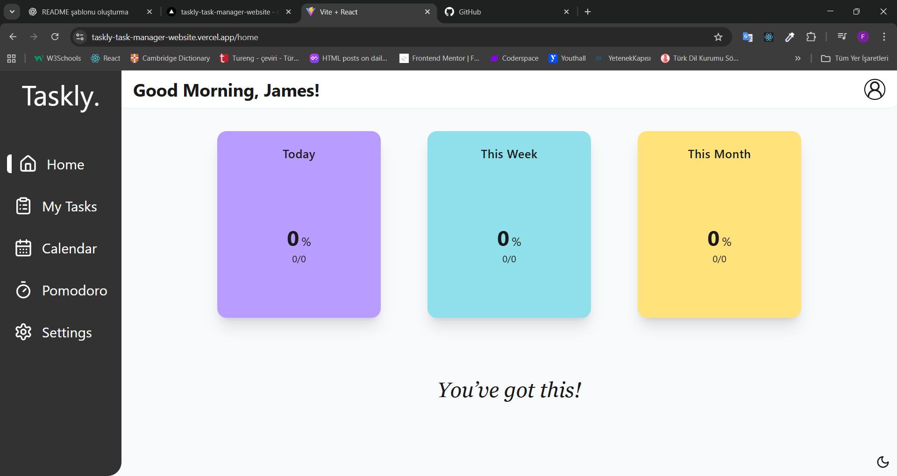
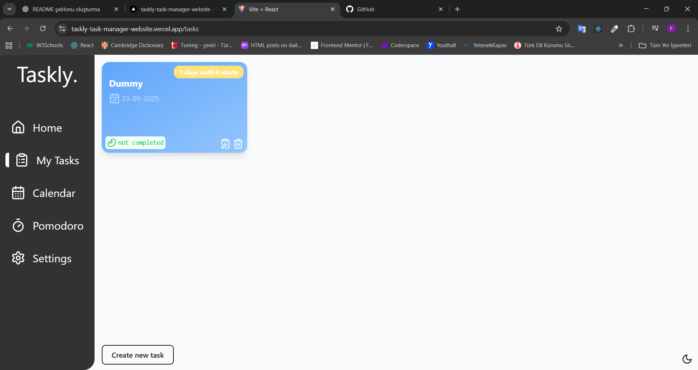
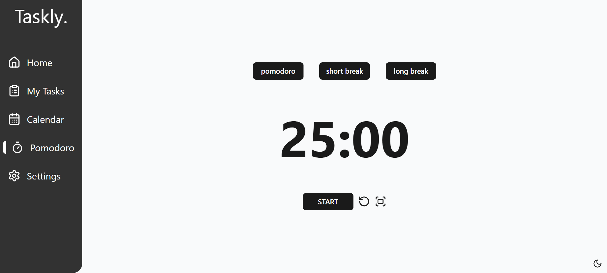

# 📌 Taskly

Bu proje React ile geliştirilmiş bir görev yönetim uygulamasıdır. Kullanıcıların günlük görevlerini kolayca takip etmelerine olanak tanırken, pomodoro tekniği ile odaklanarak verimli çalışmaları için de bir zamanlayıcı sunar.

---

## 🚀 Özellikler

- 📋 **Görev Yönetimi**

  - Yeni görev ekleme
  - Görevleri güncelleme
  - Görevleri silme
  - Tüm görevleri listeleme

- ⏱️ **Pomodoro Entegrasyonu**

  - Odaklanma süresi için pomodoro zamanlayıcısı
  - Çalışma ve mola sürelerini yönetme

- 🎨 **Tema ve Stil**
  - Dark mode desteği
  - Responsive tasarım

---

## 🛠️ Kullanılan Teknolojiler

- React
- Redux
- Tailwind CSS

---

## 📷 Ekran Görüntüleri

### Home Sayfası

### Tasks Sayfası

### Pomodoro Sayfası

---

## 📅 Gelecek Versiyonlar

- [ ] 👥 Kullanıcı hesabı oluşturma ve giriş sistemi
- [ ] ☁️ Backend entegrasyonu ile verilerin kalıcı olarak saklanması
- [ ] ✅ Görevleri filtreleme ve arama özelliği
- [ ] 🧩 Responsive tasarımı iyileştirme

- [ ] ⚙️ **Settings Sayfası**

  - Hesap ayarları yönetimi
  - Dark / Light tema seçimi
  - Pomodoro sürelerini kullanıcıya göre özelleştirme

---
